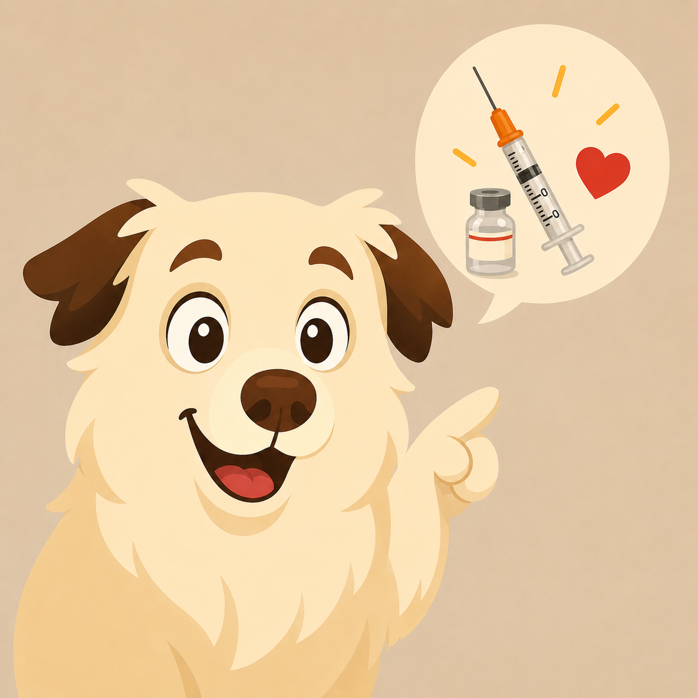
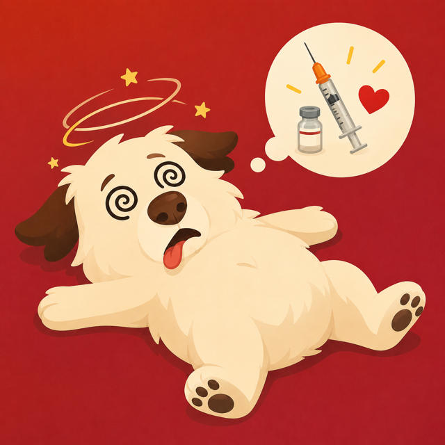
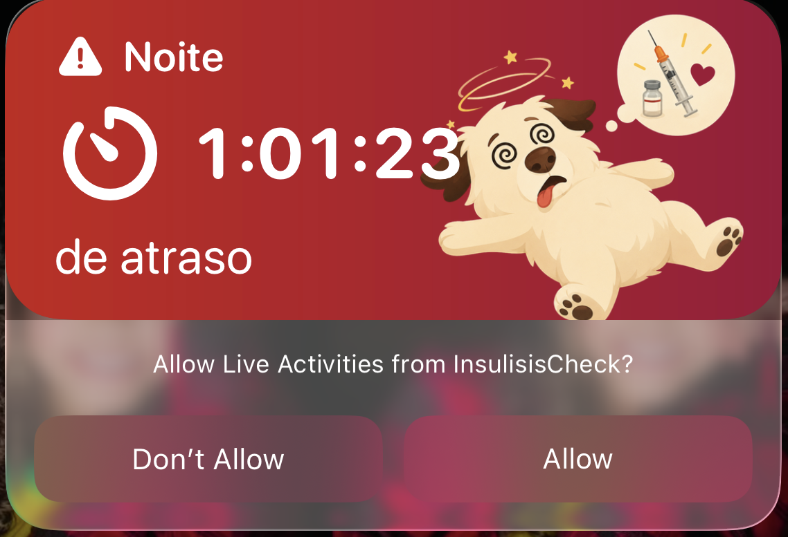

# Insulísis Check

Insulísis Check é um app iOS criado para ajudar na rotina de cuidado com a Isis, minha cachorra diabética.

O objetivo do projeto é simples: reduzir o risco de esquecer uma aplicação de insulina ou ficar em dúvida se a dose já foi aplicada. A ideia é ter um registro rápido, claro e compartilhado das aplicações, separado por período e por data.


## Visual do app

O app usa ilustrações da Isis para deixar o status da rotina mais evidente:

| Tudo certo | Hora da dose | Dose atrasada |
| --- | --- | --- |
|  |  |  |

### Live Activity

Quando uma dose passa do período de tolerância, o app exibe uma Live Activity na tela bloqueada com a contagem de quanto tempo a dose está atrasada.



## Por que este app existe

Cuidar de um pet diabético exige constância. A glicose precisa ser acompanhada, a insulina precisa ser aplicada nos horários certos e, no meio da rotina, é fácil surgir aquela dúvida:

> "Será que eu já apliquei a dose da manhã?"

Este app nasceu para responder essa pergunta rapidamente e dar mais tranquilidade no dia a dia.

## Principais recursos

- Registro das doses da manhã e da noite.
- Controle por data.
- Registro de quem aplicou a insulina.
- Registro manual com horário e quantidade de unidades.
- Atalhos da Siri para marcar uma dose como aplicada.
- Compartilhamento via iCloud/CloudKit para que mais de uma pessoa veja os mesmos registros.
- Widget para acompanhar o status da próxima dose.
- Live Activity na tela bloqueada para acompanhar quanto tempo uma dose está atrasada.
- Push notifications no horário da aplicação e lembretes de atraso.
- Notificações compatíveis com Apple Watch, seguindo o encaminhamento nativo do iOS.
- Cálculo da próxima aplicação com base no intervalo de 12 horas desde a última dose.
- Identificadores de acessibilidade para apoiar automação com XCUITest.

## Rotina que o app ajuda a controlar

A Isis recebe insulina a cada 12 horas. Quando uma aplicação é registrada, o app calcula automaticamente o próximo horário esperado.

Se uma dose não for marcada como aplicada no horário previsto, o app entra primeiro no estado de dose pendente. Depois de 15 minutos, a dose passa a ser considerada atrasada, com destaque visual, notificação e Live Activity.

Também é possível voltar uma dose para pendente caso uma aplicação tenha sido marcada por engano.

## Automação de testes

A interface possui `accessibilityIdentifier` nos principais elementos para facilitar testes com XCUITest. Alguns exemplos:

```swift
app.buttons["home.manual-entry.button"]
app.buttons["dose-card.morning.action-button"]
app.buttons["dose-card.night.action-button"]
app.pickers["manual.period.picker"]
app.pickers["manual.caregiver.picker"]
app.steppers["manual.units.stepper"]
app.datePickers["manual.date-picker"]
app.buttons["manual.save.button"]
app.buttons["manual.mark-pending.button"]
```

## Tecnologias

- Swift
- SwiftUI
- App Intents / Siri Shortcuts
- WidgetKit
- ActivityKit / Live Activities
- CloudKit
- UserNotifications
- XCUITest-ready accessibility identifiers

## Status do projeto

Este é um projeto pessoal, feito para uma necessidade real da nossa rotina familiar. Ele pode evoluir conforme novas necessidades aparecerem no cuidado diário com a Isis.

## Observação

Este app não substitui orientação veterinária. Ele é apenas uma ferramenta de apoio para organização e registro da rotina de cuidado.
